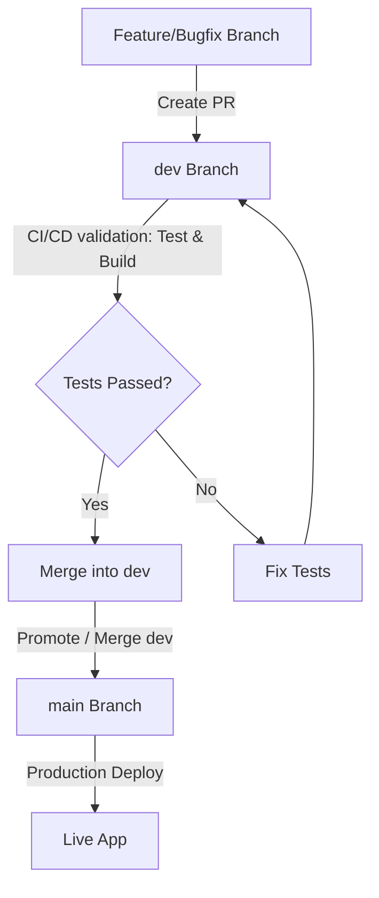

# Testing & Code Coverage Documentation

This document outlines the testing strategy, standards, and code coverage metrics for the FinTrack SaaS platform.

## Codecov Status & Graphs

### Project Coverage Badge

### Coverage Sunburst / Tree Graph
Below is the live coverage tree map for the codebase:

---

## Development Branch Workflow

To maintain code quality and ensure features are thoroughly tested before release, we enforce a strict branch-based development workflow:

1. **Development (`dev`):** All feature development and bug fixes must target the `dev` branch. Pull requests must be opened from working branches to `dev`.
2. **Main / Production (`main`):** Once features are stabilized in `dev`, a pull request is raised from `dev` to `main`. This is our production-ready branch.
3. **CI/CD Triggers:** Automated test workflows (including Vitest tests, coverage upload, and Codecov Bundle Analysis) run on every push and pull request targeting both `dev` and `main` branches.

---

## Testing Framework & Architecture

For frontend validation, we use **Vitest** combined with **React Testing Library (RTL)**.

### Architectural Decisions (ADR)
For details on the testing setup, configuration, and coverage thresholds, see [ADR-030: Adopt Vitest and React Testing Library for Frontend Testing](file:///D:/01_Projects/fintrack-saas/docs/decisions/030-adopt-vitest-and-react-testing-library-for-frontend-testing.md).

### Coverage Threshold Guidelines
- **Global Thresholds:** Initially set to `10%` statements and `9%` functions to accommodate initial setup and roll out incremental test cases without blocking the build pipelines.
- **Goal:** Gradually increase global coverage thresholds to `80%+` as the project matures.
