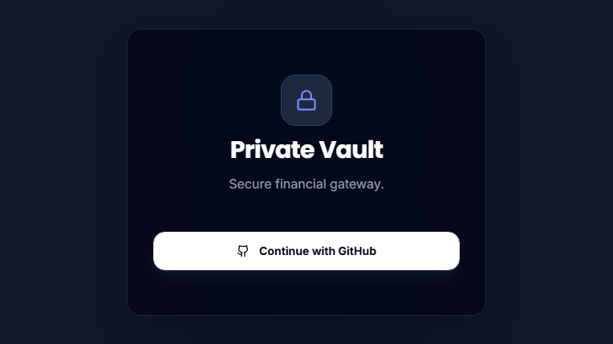
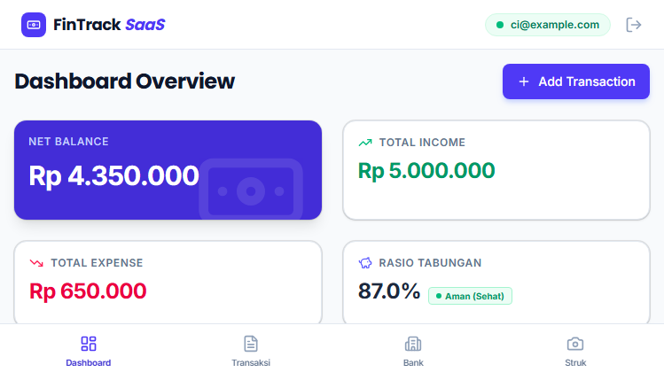
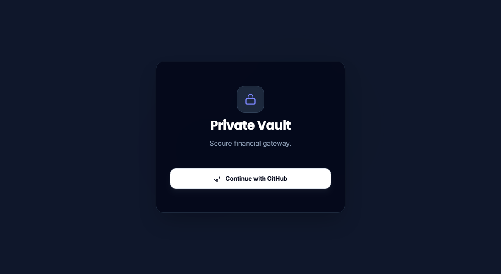
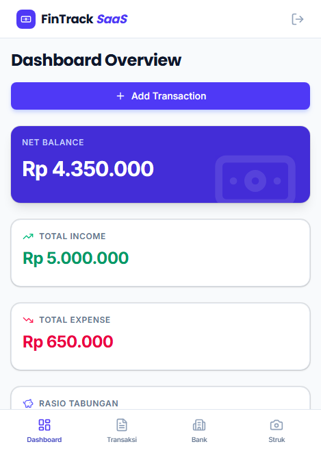

# Panduan Pengguna: Fitur Autentikasi (Login & Logout)

Dokumen ini adalah panduan penggunaan fitur Login pada aplikasi FinTrack SaaS. Alur ini dirancang untuk memberikan kemudahan dan keamanan akses bagi setiap pengguna.

## 1. Mengakses Halaman Login
*   **Langkah:** Buka alamat aplikasi dan masuk ke halaman `/login` melalui peramban web Anda.
*   **Yang Akan Anda Lihat:** Halaman selamat datang yang minimalis. Anda akan melihat tulisan utama **"Private Vault"** yang menandakan bahwa brankas finansial Anda siap diakses, beserta sebuah tombol besar bertuliskan **"Continue with GitHub"**.

## 2. Masuk ke Dalam Aplikasi
*   **Langkah:** Klik tombol **"Continue with GitHub"**.
*   **Proses:** Sistem akan mengarahkan Anda dengan aman ke penyedia layanan GitHub. Jika Anda sudah pernah memberikan izin akses (atau jika fitur *bypass* sedang diaktifkan oleh admin), Anda akan langsung masuk ke dalam aplikasi tanpa perlu mengetikkan kata sandi.

## 3. Menuju Beranda (Dashboard)
*   **Yang Akan Terjadi:** Setelah login berhasil, sistem secara otomatis akan memindahkan Anda (*redirect*) ke halaman beranda (`/`). 
*   **Yang Akan Anda Lihat:** Anda akan disambut oleh tulisan **"Dashboard Overview"**, yang merupakan pusat ringkasan arus kas dan aktivitas keuangan harian Anda. Mulai dari titik ini, Anda sudah bisa menggunakan seluruh fitur aplikasi.

## 4. Keluar dari Aplikasi (Logout)
*   **Langkah (Desktop):** Temukan menu profil atau navigasi di sisi kiri/bawah layar Anda. Klik tombol **"Keluar"** (atau ikon keluar/logout).
*   **Yang Akan Terjadi:** Anda akan secara aman diputus dari sesi aplikasi dan dikembalikan ke halaman login utama.
*   **Keamanan:** Logout memastikan seluruh data keuangan pribadi Anda terkunci dengan rapat dan tidak dapat diakses oleh pihak lain yang meminjam komputer Anda.

## 5. Akses Logout via Ponsel (Mobile View)
*   **Langkah (Mobile):** Jika Anda mengakses melalui *smartphone*, tombol "Keluar" terdapat di dalam panel navigasi bawah (bottom navigation) yang dirancang khusus agar mudah dijangkau ibu jari.
*   **Yang Akan Terjadi:** Mengklik tombol ini akan memberi efek serupa, yaitu memulangkan Anda ke layar *login* yang aman.

