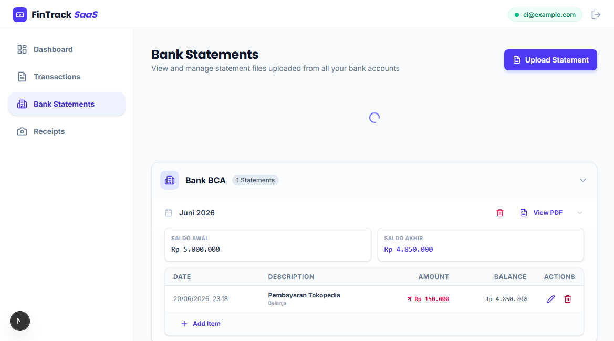
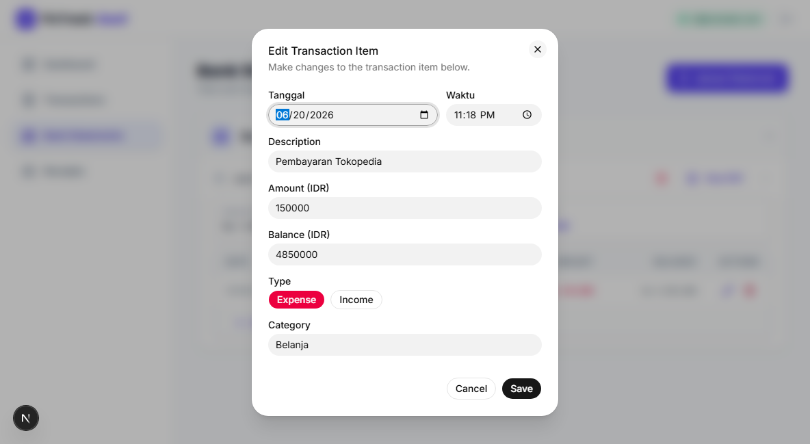
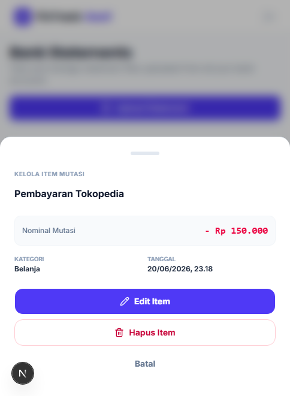

# Panduan Pengguna: Mutasi Bank (Bank Statements)

Dokumen ini adalah panduan interaktif bagi Anda (pengguna) saat menggunakan fitur pengelolaan Mutasi Bank di aplikasi FinTrack SaaS. 

## 1. Melihat Mutasi Bank
*   **Langkah:** Buka halaman *Mutasi Bank* dari menu di samping layar.
*   **Yang Akan Anda Lihat:** Sebuah tampilan yang dikelompokkan berdasarkan Nama Bank, memuat seluruh riwayat transaksi mutasi yang pernah diimpor atau dicatat.
*   **Sistem Akordeon (Grup):** Anda bisa menyembunyikan atau membuka grup bank dan grup periode waktu tertentu hanya dengan mengklik judul grup tersebut (menggunakan panah tarik-turun).

## 2. Melihat & Mengedit Rincian Item Mutasi
*   **Langkah:** Pada salah satu baris mutasi, klik tombol aksi yang berbentuk pensil (ikon edit) di pojok kanan baris tersebut.
*   **Jendela Pop-up:** Sebuah jendela (*modal*) akan muncul membawa data lengkap tentang item mutasi tersebut. Anda dapat menyesuaikan atau memperbaiki data transaksinya dari layar ini tanpa harus berpindah halaman.
*   **Menutup Jendela:** Cukup tekan tombol Batal atau tombol *Escape* (Esc) pada keyboard Anda untuk menutupnya dengan aman.

## 3. Tampilan Mudah di Ponsel (Mobile View)
*   **Antarmuka Responsif:** Fitur Mutasi Bank menyesuaikan diri ketika diakses menggunakan layar gawai pintar (HP) Anda. Format tabel yang lebar akan digantikan dengan blok-blok kartu (*card blocks*) agar nyaman dipandang.
*   **Laci Interaktif:** Sama seperti di komputer, saat Anda menekan (*tap*) salah satu kartu mutasi, rincian kelolanya akan otomatis meluncur dari bagian bawah layar membentuk laci aksi (*Action Drawer*).

