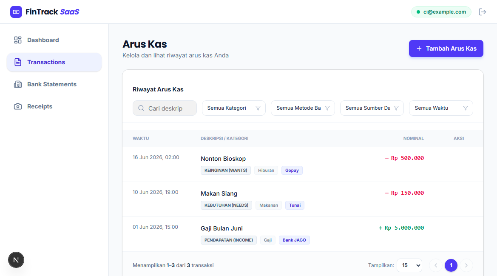
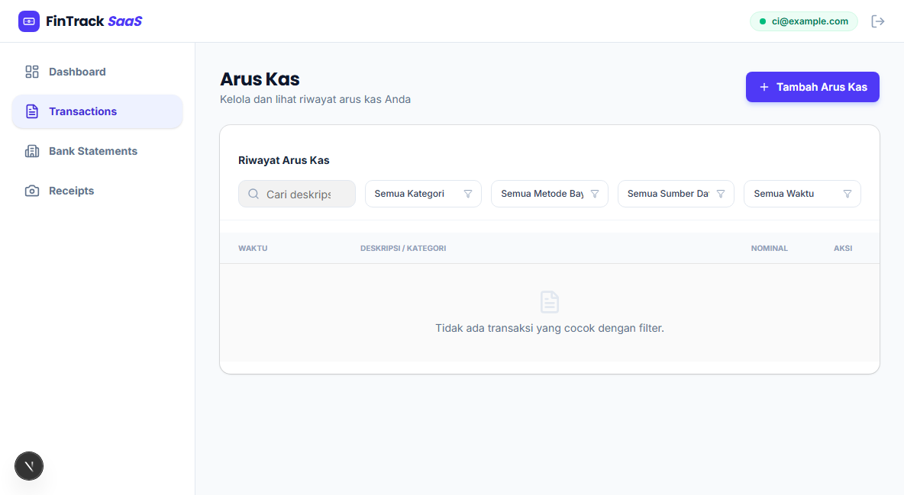
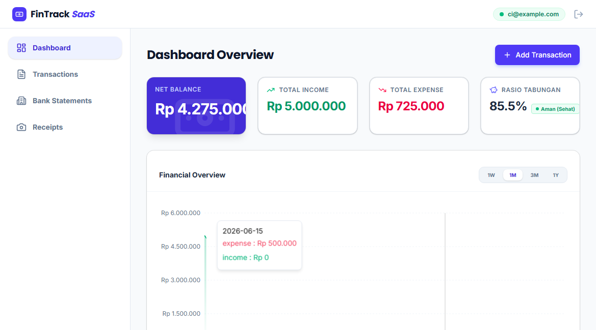
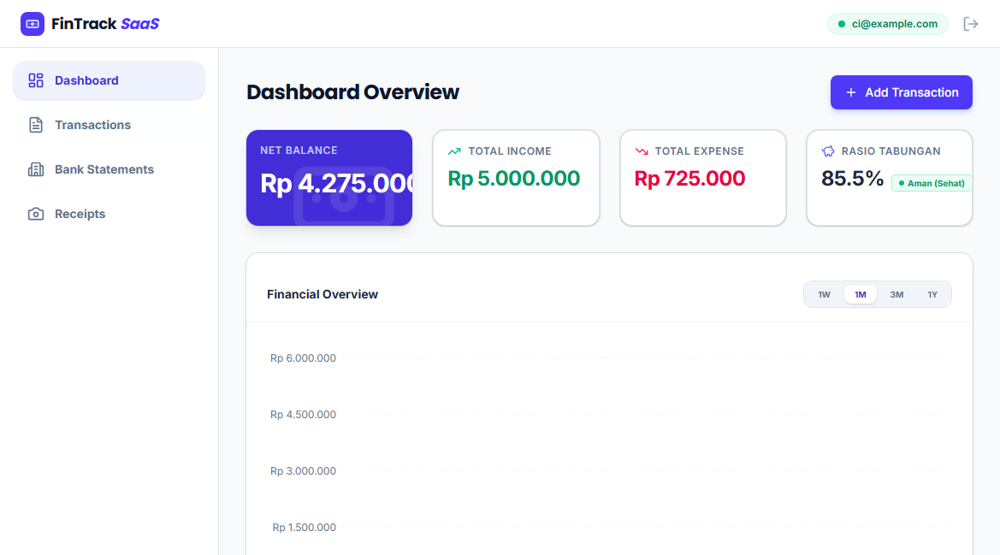
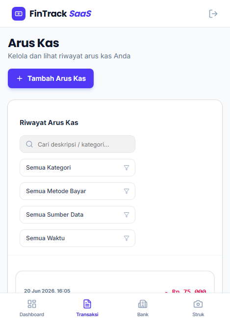

# Panduan Pengguna: Arus Kas (Cash Flow)

Dokumen ini adalah panduan interaktif bagi Anda (pengguna) saat menggunakan fitur pengelolaan Arus Kas (Transaksi) di aplikasi FinTrack SaaS.

## 1. Melihat Riwayat Arus Kas
*   **Langkah:** Buka halaman *Arus Kas* dari menu navigasi.
*   **Yang Akan Anda Lihat:** Sebuah tabel yang rapi berisi seluruh riwayat pemasukan dan pengeluaran Anda.
*   **Filter & Pencarian:** Terdapat kolom pencarian untuk memfilter deskripsi atau kategori, serta menu *dropdown* untuk menyaring berdasarkan Kategori Besar dan Metode Pembayaran. Anda juga dapat melihat *empty state* jika belum ada transaksi.

## 2. Menambah Arus Kas Baru
*   **Langkah:** Klik tombol **"Tambah Arus Kas"** yang ada di pojok kanan atas tabel.
*   **Pengisian Form:** Anda akan dibawa ke halaman form entri. Di sini, Anda wajib mengisi Tanggal, Kategori, Metode Pembayaran, Deskripsi, serta Nominal (Pemasukan atau Pengeluaran).
*   **Integrasi Cerdas:** Jika Anda telah memindai struk sebelumnya, Anda bisa menghubungkan struk tersebut, dan sistem akan otomatis mengisi nominal pengeluaran untuk Anda.

## 3. Mengubah Data (Edit Transaksi)
*   **Langkah:** Pada baris transaksi di tabel, arahkan kursor (hover) lalu klik ikon "Edit" (Pencil).
*   **Yang Akan Terjadi:** Anda akan diarahkan kembali ke halaman form yang sudah terisi dengan data transaksi sebelumnya. Anda dapat mengubah detail apapun lalu menekan "Simpan Perubahan".

## 4. Akses Fleksibel dari Ponsel (Mobile View)
*   Sama seperti fitur lainnya, halaman Arus Kas dirancang sangat responsif. Jika dibuka dari perangkat *mobile*, tabel transaksi akan berubah menjadi daftar kartu (*card list*) yang dioptimalkan untuk layar sentuh.
*   Saat Anda mengetuk (*tap*) salah satu kartu transaksi, rincian lengkapnya akan muncul dalam laci (*drawer*) dari bawah layar, memungkinkan Anda untuk langsung mengedit atau menghapus entri tersebut.

