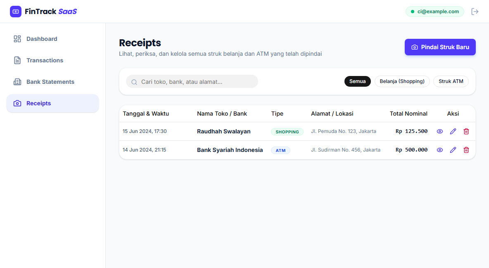
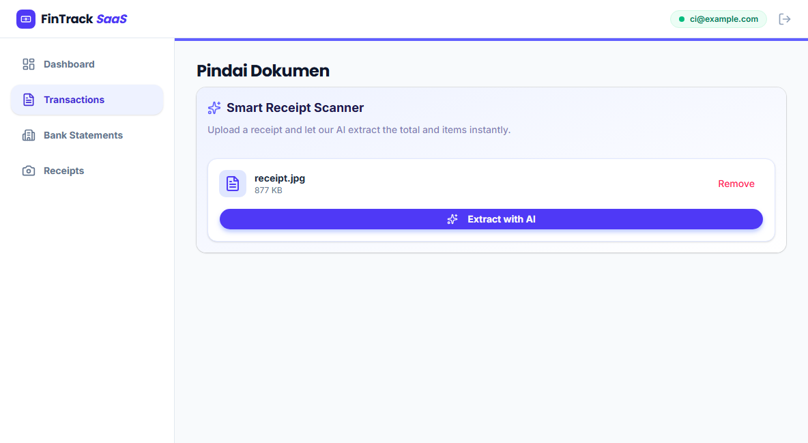
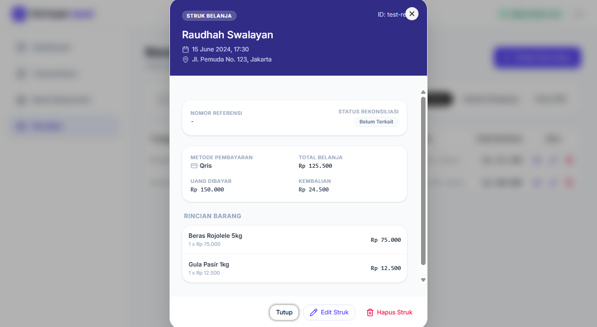
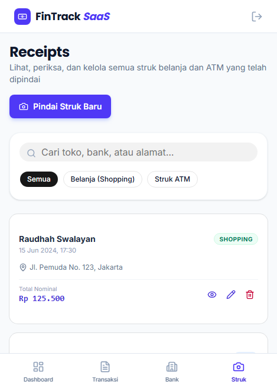

# Panduan Pengguna: Fitur Struk (Receipts)

Dokumen ini adalah panduan interaktif bagi Anda (pengguna) saat menggunakan fitur pengelolaan Struk / Bukti Transaksi di aplikasi FinTrack SaaS. 

## 1. Melihat Daftar Struk
*   **Langkah:** Buka halaman *Receipts*.
*   **Yang Akan Anda Lihat:** Sebuah tabel yang rapi berisi seluruh data struk yang pernah Anda simpan, lengkap dengan informasi toko, tanggal, hingga nominal. 
*   **Filter Data:** Anda dapat mencari struk secara instan menggunakan kotak pencarian, atau menyaring tipe struk dengan tombol kategori (*Semua*, *Belanja/Shopping*, atau *Struk ATM*).

## 2. Memindai Struk Baru dengan AI
*   **Langkah:** Klik tombol **"Pindai Struk Baru"** yang ada di pojok kanan atas layar Anda.
*   **Proses Mengunggah:** Anda akan dibawa ke halaman pemindaian. Cukup seret (drag) foto struk ke dalam kotak area putus-putus yang disediakan, atau klik kotak tersebut untuk mencari gambar di komputer Anda.
*   **Sistem Cerdas AI:** Begitu gambar dimasukkan dan tombol **"Extract with AI"** ditekan, sistem cerdas kami akan langsung membaca teks di dalamnya dan mengisikan data struk untuk Anda tanpa perlu mengetik manual.

## 3. Memeriksa Detail Struk
*   **Langkah:** Jika Anda ingin melihat rincian barang dari struk belanja tertentu, cukup klik pada salah satu baris struk yang ada di tabel.
*   **Yang Akan Terjadi:** Jendela pop-up (*Modal*) akan terbuka menampilkan seluruh detail transaksi dengan sangat jelas. Jika sudah selesai, Anda cukup menekan tombol "Tutup".

## 4. Akses Fleksibel dari Ponsel (Mobile View)
*   Fitur ini didesain sepenuhnya responsif. Jika Anda sedang berpergian dan membuka halaman ini dari *smartphone* (HP), tampilan tabel akan secara otomatis berubah menjadi desain kartu (*Card View*) yang jauh lebih nyaman untuk di- *scroll* menggunakan sentuhan jari.

## 5. Menghapus Data Struk
*   **Langkah:** Pada daftar tabel struk, klik ikon tempat sampah (tombol Hapus) yang berada di ujung kanan baris struk.
*   **Konfirmasi Keamanan:** Demi mencegah penghapusan yang tidak disengaja, browser akan memunculkan pesan konfirmasi peringatan.
*   **Hasil:** Jika Anda menekan "OK" (Setuju), struk tersebut beserta seluruh data rincian barang di dalamnya akan terhapus selamanya, dan akan langsung menghilang dari pandangan Anda di tabel daftar struk.
